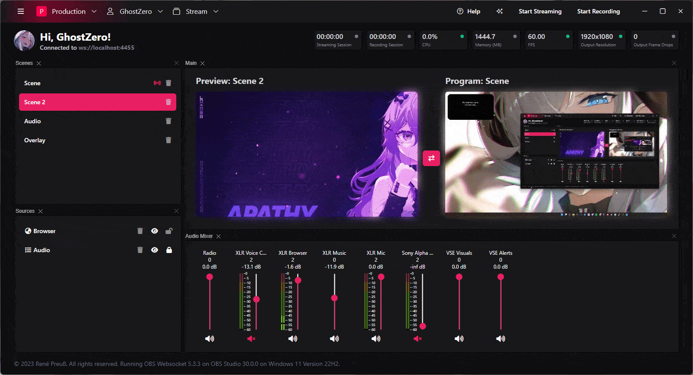

# OBS Workbench (ALPHA)

With OBS Remote Control you can control your OBS Studio from other devices in the same network. This is a web
application that runs in your browser and communicates with OBS Studio via WebSockets.

> This project is not affiliated with OBS or any of their partners. All copyrights reserved to their respective owners.
> I do not recommend using this in production environments as it is still in early development.

## Goals

My goal is to create a web application that can be used to control OBS Studio from any device in the world to serve the
needs for IRL streamers. I want to make it as easy as possible to use and setup. I want to make it as secure as possible
to use. I want to make it as reliable as possible to use.

## Features

- Fancy UI
- Display preview and program scenes
- Switch scenes between preview and program
- Toggle visibility and lock of sources

## Work in Progress

I still have some few features to implement before I can call this a beta version. I will update this list as I go.

- [x] Support for Audio Mixer controls
- [ ] Support for Simple Mode
- [ ] Support for Multiview
- [x] Switching between Scene Collections
- [x] Switching between Profiles
- [x] Accounts System for additional features
- [ ] SRT Ingest and Source for IRL streaming
- [ ] Build-in Ingress Server for localhost
